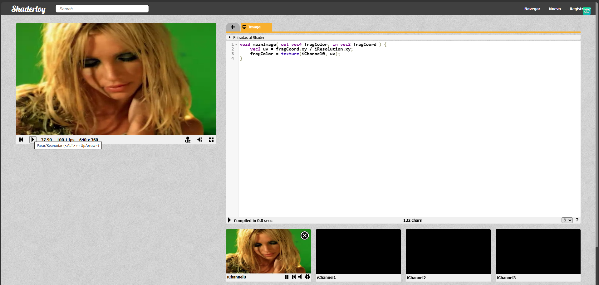

# Informe TP4 — Programación Paralela en GPU con Shaders (WebGL/GLSL)

**Materia:** Sistemas Distribuidos y Programación Paralela  
**Grupo:** 404  
**Integrantes:** Renzo Robles, Axel Hoffman, Tobias Avila  
**Fecha:** 15/05/2026

---

## Índice

1. [Hit #1 — Pixel Shaders y Pipeline de Renderizado](#hit-1--pixel-shaders-y-pipeline-de-renderizado)
2. [Hit #2 — Pintando con Código (Inigo Quilez)](#hit-2--pintando-con-código-inigo-quilez)
3. [Hit #3 — Shader Base: Copia de iChannel0](#hit-3--shader-base-copia-de-ichannel0)
4. [Hit #4 — Flip-Y y Flip-X](#hit-4--flip-y-y-flip-x)
5. [Hit #5 — Chroma Key](#hit-5--chroma-key)
6. [Hit #6 — Filtro Escala de Grises](#hit-6--filtro-escala-de-grises)
7. [De Pixel Shaders a CUDA](#de-pixel-shaders-a-cuda)
8. [Conclusiones](#conclusiones)

---

## Hit #1 — Pixel Shaders y Pipeline de Renderizado

### Tipos de Shaders

| Tipo | Función | Etapa |
|------|---------|-------|
| **Vertex Shader** | Transforma la posición de cada vértice del espacio 3D al espacio de proyección | 3D |
| **Pixel (Fragment) Shader** | Calcula el color final de cada píxel en pantalla | 2D |
| **Geometry Shader** | Genera o descarta primitivas completas (triángulos, líneas, puntos) | 3D |
| **Tessellation Shader** | Subdivide geometría de baja resolución en alta resolución (LOD adaptativo) | 3D |
| **Compute Shader** | Propósito general (GPGPU): kernels de cómputo arbitrario fuera del pipeline gráfico | — |

### Pipeline de Renderizado WebGL (6 pasos)

```
┌─────────────────────────────────────────────────────────────────────┐
│                      PIPELINE DE RENDERIZADO GPU                     │
│                                                                     │
│   3D                           │            2D                      │
│                               │                                     │
│  ┌──────────┐   ┌──────────┐  │  ┌──────────┐  ┌──────────┐        │
│  │ Vertex   │──▶│ Vertex   │  │  │ Rasteri- │──▶│ Fragment │        │
│  │ Spec     │   │ Shader   │──┼─▶│ zación   │   │ Shader   │──┐     │
│  └──────────┘   └──────────┘  │  └──────────┘  └──────────┘  │     │
│                               │                              │     │
│                               │              ┌──────────┐    │     │
│                               │              │ Per-Frag │◀───┘     │
│                               │              │ Tests    │──┐      │
│                               │              └──────────┘  │      │
│                               │              ┌──────────┐  │      │
│                               │              │ Framebuf │◀─┘      │
│                               │              │ Output   │         │
│                               │              └──────────┘         │
└──────────────────────────────────────────────────────────────────┘
```

**Clasificación 3D vs 2D:**

| Etapa | Dimensión |
|-------|-----------|
| 1. Vertex Specification | 3D |
| 2. Vertex Shader | 3D |
| 3. Primitive Assembly & Rasterización | Transición 3D → 2D |
| 4. Fragment Shader | 2D |
| 5. Per-Fragment Tests | 2D |
| 6. Framebuffer Output | 2D |

### Video Post-Processing

El post-procesamiento ocurre **después** del Framebuffer Output. La escena se renderiza a un framebuffer en memoria, que luego se usa como textura de entrada para un segundo Fragment Shader. Técnicas comunes: bloom, depth of field, motion blur, anti-aliasing temporal, corrección de color, SSAO.

### Entradas de ShaderToy

| Input | Tipo | Descripción |
|-------|------|-------------|
| `iResolution` | `vec3` | Ancho, alto y pixel aspect ratio del viewport |
| `iTime` | `float` | Tiempo de reproducción en segundos |
| `iTimeDelta` | `float` | Tiempo del frame anterior |
| `iFrame` | `int` | Número de frame actual |
| `iMouse` | `vec4` | Coordenadas del mouse (xy: posición, zw: click) |
| `iChannel0..3` | `samplerXX` | Canales de entrada (texturas, videos, webcam, audio) |
| `iDate` | `vec4` | Fecha actual (año, mes, día, segundos) |

### Salida del Pixel Shader

```glsl
void mainImage( out vec4 fragColor, in vec2 fragCoord );
```

- **`fragCoord`** (`vec2`, entrada): coordenadas del píxel actual en píxeles
- **`fragColor`** (`vec4`, salida): color del píxel en formato RGBA [0.0, 1.0]

### Análisis del Shader "Hello World"

```glsl
void mainImage( out vec4 fragColor, in vec2 fragCoord ) {
    vec2 uv = fragCoord/iResolution.xy;
    vec3 col = 0.5 + 0.5*cos(iTime+uv.xyx+vec3(0,2,4));
    fragColor = vec4(col,1.0);
}
```

| Concepto | Explicación |
|----------|-------------|
| **`uv`** | Coordenadas normalizadas del píxel en rango [0,1]. Se obtiene dividiendo `fragCoord` por `iResolution.xy`. |
| **¿Por qué UV y no XY?** | UV es **resolution-independent**: un shader funciona igual en 800×600 que en 1920×1080. XY en píxeles absolutos no es portable. |
| **Animación** | `iTime` cambia en cada frame. El coseno de `iTime + posición` produce colores que oscilan continuamente. El shader es `f(tiempo, posición) → color`. |
| **`vec3 col = 0.5 + 0.5*cos(...)`** | GLSL aplica **promoción de escalares**: `0.5` se convierte a `vec3(0.5, 0.5, 0.5)` y opera componente a componente. |
| **Swizzling `uv.xyx`** | Toma un `vec2(uv.x, uv.y)` y produce un `vec3(uv.x, uv.y, uv.x)`. Permite reordenar componentes arbitrariamente. |
| **`vec4(col, 1.0)`** | Constructor que combina un `vec3` (RGB) + un `float` (Alpha = 1.0 = opaco). |
| **Swizzling** | Propiedades de `vec2`: `.x`/`.r`/`.s`, `.y`/`.g`/`.t`. De `vec3`: + `.z`/`.b`/`.p`. De `vec4`: + `.w`/`.a`/`.q`. Se pueden combinar: `uv.xyx`, `col.bgr`, `fragColor.rg`. |

---

## Hit #2 — Pintando con Código (Inigo Quilez)

### Resumen del Video

El video "Painting a Landscape with Maths" de Inigo Quilez demuestra la creación de un paisaje fotorrealista completo (montañas, cielo, niebla, iluminación) **sin modelos 3D, sin texturas, sin motor gráfico** — únicamente con fórmulas matemáticas ejecutadas en un Fragment Shader.

### Técnicas Utilizadas

| Técnica | Descripción |
|---------|-------------|
| **Raymarching** | Cada píxel lanza un rayo que avanza paso a paso evaluando una función de distancia hasta intersectar el terreno. No hay malla poligonal. |
| **fBm (Fractional Brownian Motion)** | Suma de capas de ruido a distintas frecuencias y amplitudes para generar terreno orgánico con detalle en múltiples escalas. |
| **Colorización procedural** | El color de cada punto se calcula de su altura (nieve en cimas, vegetación en valles), inclinación (roca en pendientes) y variación de ruido. |
| **Iluminación** | Luz solar directa (dot product normal·sol), sombras suaves (segundo raymarching), Ambient Occlusion, niebla atmosférica, color de cielo por gradiente matemático. |

### Conclusiones

1. **El pipeline 3D tradicional no es el único camino.** No se necesitan vértices ni triángulos: un Fragment Shader puede reconstruir geometría implícita mediante raymarching.
2. **La matemática es el modelo artístico.** Ajustar el paisaje significa modificar coeficientes de ruido y umbrales de smoothstep.
3. **GPU como motor de cómputo general.** Cada píxel ejecuta su propio raymarching independiente: GPGPU disfrazado de gráfico.
4. **Compresión extrema.** Un paisaje que requeriría gigabytes de assets se codifica en decenas de líneas de código.

---

## Hit #3 — Shader Base: Copia de iChannel0

### Código

```glsl
void mainImage( out vec4 fragColor, in vec2 fragCoord ) {
    vec2 uv = (fragCoord.xy / iResolution.xy);
    fragColor = texture(iChannel0, uv);
}
```

### Explicación

- `uv` normaliza las coordenadas del píxel al rango [0, 1]
- `texture(iChannel0, uv)` samplea la textura de entrada en la posición UV y devuelve el color RGBA
- El resultado es una copia 1:1 de la imagen de entrada a la pantalla

### Captura


---

## Hit #4 — Flip-Y y Flip-X

### Concepto

Cualquier transformación geométrica de la imagen se logra únicamente modificando las coordenadas UV **antes** de samplear la textura. No se mueven píxeles: se cambia desde dónde se lee la textura.

### Códigos

**Flip-Y (volteo vertical):**
```glsl
uv.y = 1.0 - uv.y;
```

**Flip-X (espejo horizontal):**
```glsl
uv.x = 1.0 - uv.x;
```

**Flip-XY simultáneo (rotación 180°):**
```glsl
uv = 1.0 - uv;  // GLSL promueve 1.0 a vec2(1.0, 1.0)
```

### Resultados

| Original | Flip-Y | Flip-X |
|----------|--------|--------|
|  |  |  |

### Potencialidad de UV

| Operación sobre UV | Efecto visual |
|-------------------|---------------|
| `uv.y = 1.0 - uv.y` | Flip vertical |
| `uv.x = 1.0 - uv.x` | Flip horizontal (espejo) |
| `uv = 1.0 - uv` | Rotación 180° |
| `uv = uv * 2.0` | Zoom out |
| `uv = uv * 0.5 + 0.25` | Zoom in al centro |
| `uv -= 0.5; uv = mat2(cos(a),-sin(a),sin(a),cos(a)) * uv; uv += 0.5` | Rotación arbitraria |
| `uv = fract(uv * N)` | Tiling N×N |

---

## Hit #5 — Chroma Key

### Configuración

- `iChannel0` → cámara web (fondo que reemplazará al verde)
- `iChannel1` → video con green screen (Britney Spears)

### Código

```glsl
void mainImage( out vec4 fragColor, in vec2 fragCoord ) {
    vec2 uv = fragCoord.xy / iResolution.xy;

    vec4 chromaColor = vec4(0.0, 1.0, 0.0, 1.0);  // verde puro
    float threshold  = 0.45;

    vec4 fg = texture(iChannel1, uv);  // video con green screen
    vec4 bg = texture(iChannel0, uv);  // webcam

    float dist = distance(fg.rgb, chromaColor.rgb);  // distancia euclidiana 3D

    if (dist < threshold)
        fragColor = bg;   // reemplazar por webcam
    else
        fragColor = fg;   // dejar el video original
}
```

### Explicación

- `distance()` calcula `sqrt((R₁−R₂)² + (G₁−G₂)² + (B₁−B₂)²)` entre el color del píxel y el verde puro
- Si la distancia es menor al umbral, el píxel se considera "fondo verde" y se reemplaza por la webcam
- Si supera el umbral, se deja el video original

### Probando Umbrales

| Threshold | Resultado |
|-----------|-----------|
| `0.1` | Casi no saca nada. Quedan halos verdes. |
| `0.45` | Punto medio óptimo. Elimina el fondo sin comerse al sujeto. |
| `0.8` | Empieza a sacar partes del sujeto con tonos verdosos. |
| `> 1.4` | Supera la distancia máxima RGB posible. Se ve solo la webcam. |

### Captura


### Decisión

- Se usó `distance()` (nativo GLSL) en lugar de implementar pitágoras manualmente por claridad y porque GLSL lo optimiza en hardware.
- Umbral `0.45` elegido empíricamente: punto donde se elimina el verde sin dañar al sujeto.

### Limitaciones

- Bordes duros sin transición (un chroma profesional usa `smoothstep` entre dos umbrales).
- Quedan halos verdes en pelo y bordes finos.
- RGB no es el espacio ideal para chroma: en YCbCr se compararía solo en los canales de crominancia.

---

## Hit #6 — Filtro Escala de Grises

### Concepto

Convertir una imagen a blanco y negro reemplazando el color de cada píxel por un único valor de gris que represente su brillo.

### Fórmula de Luminancia Perceptual (BT.601)

```
Y = 0.299 · R + 0.587 · G + 0.114 · B
```

El verde pesa ~59%, el rojo ~30% y el azul ~11%. Esto refleja la sensibilidad del ojo humano (más sensible al verde, menos al azul). Un promedio simple `(R+G+B)/3` daría resultados visualmente incorrectos (verdes se verían oscuros, azules claros).

### Código

```glsl
void mainImage( out vec4 fragColor, in vec2 fragCoord ) {
    vec2 uv = fragCoord.xy / iResolution.xy;
    vec4 color = texture(iChannel0, uv);
    float gray = 0.299 * color.r + 0.587 * color.g + 0.114 * color.b;
    fragColor = vec4(gray, gray, gray, 1.0);
}
```

### Captura


### Decisión

Se optó por BT.601 (estándar SDTV) sobre el promedio simple porque reproduce fielmente la percepción humana del brillo. Referencia: Gonzalez & Woods, *Digital Image Processing*, Cap. 3.

---

## De Pixel Shaders a CUDA

### Correspondencia Conceptual

| Shaders (GLSL) | CUDA |
|----------------|------|
| Fragment Shader (se ejecuta por píxel) | Kernel CUDA (se ejecuta por hilo/elemento) |
| `fragCoord` (coordenada del píxel) | `threadIdx + blockIdx * blockDim` (ID del hilo) |
| `iResolution` (tamaño de imagen) | `gridDim * blockDim` (grid de hilos) |
| `texture(iChannel0, uv)` (lectura de textura) | Lectura de memoria global (array en device) |
| `fragColor = ...` (escritura de color) | Escritura en memoria global (array de salida) |
| `iTime` (constante global) | Parámetro pasado al kernel |

### Taxonomía de Flynn y SIMT

- **SIMD:** una instrucción, múltiples datos (procesadores vectoriales clásicos)
- **SIMT (NVIDIA):** múltiples hilos ejecutan la misma instrucción con contextos independientes. Los hilos se agrupan en *warps* de 32 que ejecutan lockstep.
- Las GPUs modernas operan bajo **SIMT**: `mainImage` se ejecuta en miles de hilos, cada uno con su `fragCoord` única.

### Ejemplo: Chroma Key en CUDA (conceptual)

```cpp
__global__ void chroma_kernel(uchar4* entrada, uchar4* fondo, uchar4* salida, int w, int h) {
    int idx = threadIdx.x + blockIdx.x * blockDim.x;
    if (idx >= w * h) return;

    uchar4 fg = entrada[idx];
    uchar4 bg = fondo[idx];
    float dist = sqrt(powf(fg.x - 0, 2) + powf(fg.y - 255, 2) + powf(fg.z - 0, 2));
    salida[idx] = (dist < 0.45f * 255.f) ? bg : fg;
}
```

### Aplicación en el TP Integrador

En el TPI, cada hilo CUDA calculará hashes MD5 para proof-of-work de blockchain. El paradigma es el mismo que en los shaders:

```
Shader:  fragCoord → texture() → fórmula matemática → fragColor
CUDA:    threadId  → mem_read() → hash MD5          → mem_write()
```

**Cambió el dominio (gráficos → criptografía), no el paradigma (paralelismo masivo en GPU).**

---

## Conclusiones

### Sobre los shaders y el pipeline de renderizado

1. **El Fragment Shader es la pieza central del procesamiento 2D en GPU.** Permite aplicar cualquier transformación píxel a píxel sin depender del pipeline 3D.

2. **UV es el espacio de trabajo universal.** Trabajar en coordenadas normalizadas [0,1] hace que los shaders sean independientes de la resolución y permite aplicar cualquier transformación geométrica modificando UV antes del sampleo de textura.

3. **El pipeline de renderizado separa claramente el procesamiento 3D (vértices) del 2D (píxeles).** La rasterización es el punto de quiebre entre ambos dominios.

### Sobre los filtros implementados

4. **Chroma Key:** La distancia euclidiana en RGB es simple pero limitada. Un chroma profesional requiere trabajar en YCbCr, usar dos umbrales con `smoothstep`, y aplicar spill suppression para eliminar halos verdes.

5. **Escala de grises:** La fórmula de luminancia perceptual (BT.601) es significativamente mejor que el promedio simple porque pondera los canales según la sensibilidad del ojo humano.

### Sobre la relación shaders ↔ CUDA

6. **La correspondencia es directa y uno a uno.** Cada concepto en shaders tiene un equivalente en CUDA: `fragCoord` ↔ `threadIdx+blockIdx`, `texture()` ↔ memoria global, `fragColor` ↔ escritura en memoria.

7. **El paradigma SIMT es el mismo.** Tanto en shaders como en CUDA, la GPU ejecuta la misma función en miles de hilos en paralelo, cada uno con su propio identificador.

### Sobre la programación paralela en GPU

8. **Las GPUs están optimizadas para throughput, no para latencia.** Mientras una CPU tiene pocos núcleos potentes, una GPU tiene miles de núcleos simples. Esto las hace ideales para problemas masivamente paralelos como procesamiento de imágenes, simulación física o hashing criptográfico.

9. **El overhead de transferencia CPU↔GPU existe.** No todo problema se beneficia del paralelismo en GPU. Para que valga la pena, el problema debe ser "embarazosamente paralelo" (sin dependencias entre elementos) y el volumen de datos debe justificar la transferencia.