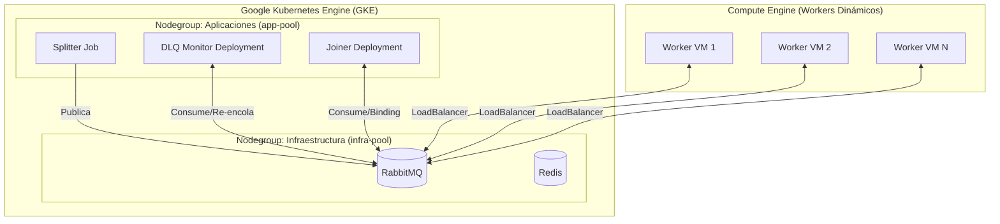

# TP3 - Grupo 404 | HIT #3: Sobel 100% Cloud Native (GKE)

Para esta parte, migramos toda la arquitectura del Filtro Sobel para que sea **100% Cloud Native**. Metimos todo el núcleo de la aplicación adentro de un cluster de Kubernetes (usamos GKE de Google), y le sumamos los patrones de mensajería para que no se rompa por cualquier cosa (resiliencia).

## Arquitectura que armamos

A diferencia del Hit #2 donde corríamos la mitad de las cosas en nuestra compu local, acá mandamos todo el cerebro a la nube. El cluster de GKE está dividido en dos nodegroups distintos, y los workers siguen estando afuera (en Compute Engine) para escalar más fácil.

### Separando las cosas (Estilo Borg/Kubernetes)

Basándonos en lo que leímos en el paper de Borg/Kubernetes, armamos el cluster separando las cargas de trabajo para no mezclar cosas críticas con cosas descartables:
- **Infra-pool**: Acá levantamos máquinas que NO son preemptibles. Las usamos para RabbitMQ y Redis porque si estas máquinas se apagan de la nada, perdemos la cola de mensajes y se cae todo el sistema.
- **App-pool**: Acá metimos máquinas preemptibles (más baratas) y le pusimos auto-escalado. Como el Splitter, el Joiner y el Monitor son *Stateless* (no guardan datos propios, todo queda en Rabbit), no pasa nada si Google nos tira una máquina; K8s levanta el Pod en otro lado y listo.

Los **Workers** los dejamos afuera de Kubernetes a propósito porque:
1. Nos permite meterles máquinas súper específicas si hace falta (por ejemplo, con GPU o mucha CPU).
2. Podemos escalar de 0 a 100 máquinas dinámicamente sin saturar los recursos ni volver loco al autoscaler del cluster de GKE.

## Patrones de Resiliencia que le metimos (Hit #0 + Hit #3)

Para que esto no explote en producción, le tuvimos que codear varias cosas a los scripts de Python:

1. **Exponential Backoff**: La red a veces falla o los pods tardan en levantar. Si el Joiner arrancaba antes que RabbitMQ, la librería `pika` tiraba error y moría el pod. Le armamos un bucle que reintenta conectarse esperando cada vez más tiempo (1s, 2s, 4s... hasta 30s) en vez de crashear de una.
2. **Dead Letter Queue (DLQ / DLX)**: Le metimos un bloque `try/except` al worker. Si al aplicar el filtro OpenCV la compu se queda sin RAM o tira error, hace un `nack(requeue=False)`. RabbitMQ intercepta esto y en vez de clavarlo en un loop, lo manda a una cola de descartes (`tareas_sobel_dlq`).
3. **DLQ Monitor (El Paramédico)**: Armamos un script en Python que se queda escuchando la DLQ. Si cae un mensaje fallido, espera un poquito y lo vuelve a meter en la cola principal para darle otra chance. *(Nota: le implementamos una validación leyendo los headers `x-death` para que, si un mensaje falla 3 veces seguidas, lo descarte definitivamente y no arme un bucle infinito).*
4. **Pub/Sub (Fanout)**: Cambiamos la forma de entregar los resultados. Ahora el `worker.py` publica los pedazos listos al exchange `resultados_exchange`. El `joiner.py` arma una cola temporal anónima y se bindea a ese exchange. Está buenísimo porque desacopla todo; si mañana queremos enchufar un dashboard en tiempo real, solo nos bindeamos al exchange sin tocar el código de los workers.
