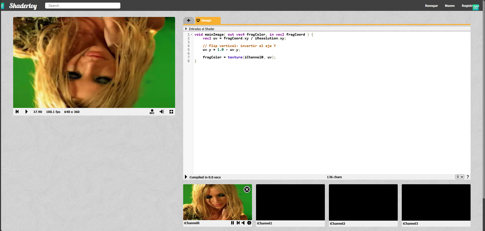
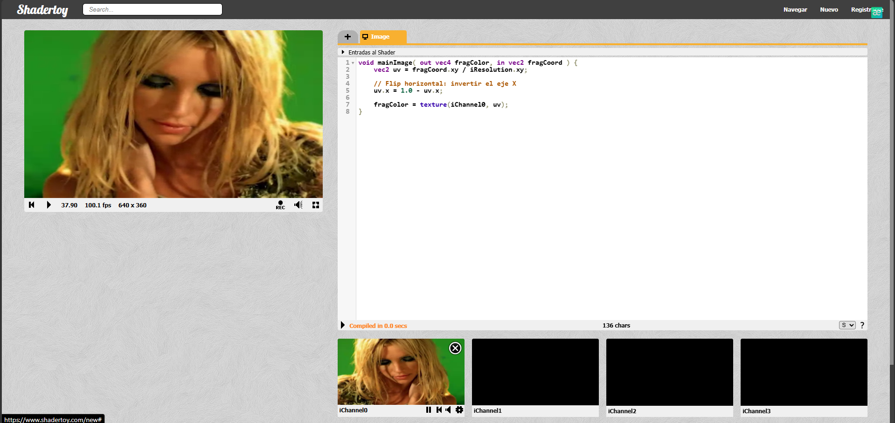

# TP4 — Programación Paralela en GPU con Shaders (WebGL/GLSL)

## Integrantes
- Renzo Robles
- Axel Hoffman
- Tobias Avila

## Descripción
Implementación de efectos visuales sobre GPU usando **Pixel Shaders** en **ShaderToy** (WebGL/GLSL). Se explora el pipeline de renderizado, manipulación de coordenadas UV, filtros de imagen (chroma key, escala de grises), y el puente conceptual hacia CUDA para computación paralela de propósito general.

---

## HIT #1 — Pixel Shaders y Pipeline de Renderizado
**Carpeta:** `hit1/` → `hit1/hit1.md`

### Contenido
- Tipos de shaders: Vertex, Pixel, Geometry, Compute, Tessellation
- Pipeline de renderizado WebGL en 6 pasos, clasificados en 3D vs 2D
- Video post-processing: definición, técnicas y etapa del pipeline
- Entradas (inputs) de ShaderToy: `iResolution`, `iTime`, `iMouse`, `iChannel0..3`, etc.
- Salida del Pixel Shader: `fragColor` (`vec4 RGBA`)
- Análisis completo del shader "hello world": UV, animación con `iTime`, swizzling (`uv.xyx`), constructores de `vec4`, promoción de escalares

### Decisiones tomadas
- Se decidió profundizar en swizzling porque es una característica exclusiva de GLSL que no existe en otros lenguajes y es esencial para entender shaders.

---

## HIT #2 — Pintando con Código (Inigo Quilez)
**Carpeta:** `hit2/` → `hit2/hit2.md`

### Contenido
- Resumen del video "Painting a Landscape with Maths"
- Técnicas: raymarching, fBm (Fractional Brownian Motion), Ambient Occlusion, niebla atmosférica
- Conclusión: la GPU como motor de cómputo general, no solo rasterización

---

## HIT #3 — Shader Base (Copia de iChannel0)
**Carpeta:** `hit3/` → `hit3/hit3.md`

### Shader
```glsl
void mainImage( out vec4 fragColor, in vec2 fragCoord ) {
    vec2 uv = (fragCoord.xy / iResolution.xy);
    fragColor = texture(iChannel0, uv);
}
```

### Resultado


---

## HIT #4 — Flip-Y / Flip-X
**Carpeta:** `hit4/` → `hit4/hit4.md`

### Implementación
- **Flip-Y:** `uv.y = 1.0 - uv.y` (volteo vertical)
- **Flip-X:** `uv.x = 1.0 - uv.x` (efecto espejo)
- **Flip-XY:** `uv = 1.0 - uv` (rotación 180°)

### Resultados
| Flip-Y | Flip-X |
|--------|--------|
|  |  |

### Decisión tomada
- Se incluyó una tabla ampliada de transformaciones UV (zoom, rotación, distorsión, tiling) para demostrar que cualquier transformación geométrica se logra modificando UV antes de `texture()`.

---

## HIT #5 — Chroma Key
**Carpeta:** `hit5/` → `hit5/hit5.md`

### Setup
- `iChannel0` → cámara web
- `iChannel1` → video con green screen (Britney Spears)

### Shader
```glsl
void mainImage( out vec4 fragColor, in vec2 fragCoord ) {
    vec2 uv = fragCoord.xy / iResolution.xy;
    vec4 chromaColor = vec4(0.0, 1.0, 0.0, 1.0); // verde puro
    float threshold  = 0.45;
    vec4 fg = texture(iChannel1, uv);
    vec4 bg = texture(iChannel0, uv);
    float dist = distance(fg.rgb, chromaColor.rgb);
    if (dist < threshold)
        fragColor = bg;
    else
        fragColor = fg;
}
```

### Resultado


### Decisión tomada
- Se usó `distance()` de GLSL en lugar de implementar pitágoras manualmente por claridad y rendimiento (GLSL lo optimiza en hardware).
- Umbral `0.45` elegido empíricamente: elimina el verde sin comerse al sujeto.

---

## HIT #6 — Escala de Grises
**Carpeta:** `hit6/` → `hit6/hit6.md`

### Shader
```glsl
void mainImage( out vec4 fragColor, in vec2 fragCoord ) {
    vec2 uv = fragCoord.xy / iResolution.xy;
    vec4 color = texture(iChannel0, uv);
    float gray = 0.299 * color.r + 0.587 * color.g + 0.114 * color.b; // BT.601
    fragColor = vec4(gray, gray, gray, 1.0);
}
```

### Resultado


### Decisión tomada
- Se usó la fórmula de luminancia perceptual BT.601 en lugar del promedio simple porque produce resultados visualmente más naturales (el ojo humano percibe el verde como más brillante).

---

## De Pixel Shaders a CUDA
**Carpeta:** `hit_cuda/` → `hit_cuda/hit_cuda.md`

Puente conceptual que muestra la correspondencia uno a uno entre cada concepto de shaders y su equivalente en CUDA.

---

## Seguridad
- `.gitignore` configurado para excluir `__pycache__/`, `.env`, `.venv/`, `.vscode/`, `*.pem`
- No se commitean credenciales ni secrets
- El pipeline de CI incluye validación de seguridad

---

## Ejecución
Todos los shaders se ejecutan en [ShaderToy](https://www.shadertoy.com):
1. Ir a https://www.shadertoy.com
2. Click en "New"
3. Pegar el código GLSL de cada hit
4. Configurar `iChannel0`, `iChannel1` según corresponda (imagen, video, webcam)

No requiere instalación local.

---

## Informe completo
Ver [`../informes/Informe_TP4.md`](../informes/Informe_TP4.md) para el informe detallado con diagramas, capturas de pantalla y conclusiones.
