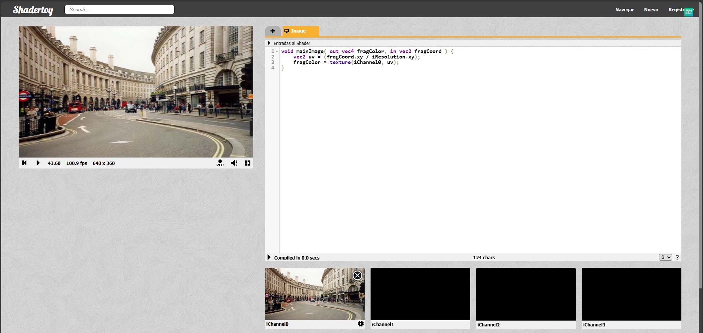

Hit #3 — Shader Base: Copiando el iChannel0
Configuración en ShaderToy
En ShaderToy, se selecciona una fuente de entrada en iChannel0. Las opciones disponibles son imágenes de ejemplo, videos de ejemplo o la cámara web. Una vez configurado, iChannel0 queda disponible como un sampler2D dentro del shader.

Shader
glslvoid mainImage( out vec4 fragColor, in vec2 fragCoord ) {
    vec2 uv = (fragCoord.xy / iResolution.xy);
    fragColor = texture(iChannel0, uv);
}
Explicación línea por línea
vec2 uv = (fragCoord.xy / iResolution.xy);
Se normalizan las coordenadas del píxel actual al rango [0.0, 1.0]. fragCoord viene en píxeles absolutos; dividir por la resolución convierte eso en coordenadas UV independientes del tamaño de la ventana.
fragColor = texture(iChannel0, uv);
La función texture() de GLSL toma un sampler y unas coordenadas UV y devuelve el color del texel correspondiente en esa posición. El resultado se escribe directamente como color de salida del fragmento.
El efecto es una copia 1:1 del canal de entrada a la pantalla: sin transformación, sin filtro.

