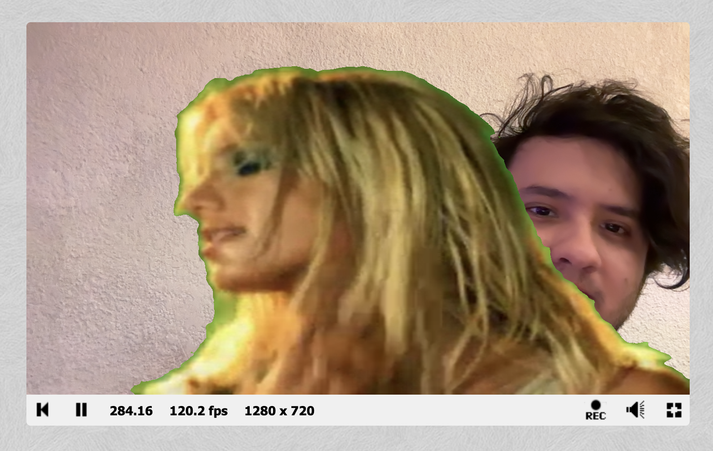

# Hit #5 — Chroma Key

## ¿Qué es?

El chroma key es el efecto del "fondo verde" que se usa en cine y en la tele. La idea es simple: si un píxel del video se parece al verde, lo reemplazamos por el píxel correspondiente de otra imagen (la cámara web en este caso). El resto del video se deja como está.

Para decidir si un píxel es "lo bastante verde" calculamos la distancia entre su color y el verde puro, y la comparamos contra un umbral.

## Setup en ShaderToy

- `iChannel0` → cámara web (el fondo que va a reemplazar al verde)
- `iChannel1` → video con green screen (ej. el ejemplo de Britney Spears de ShaderToy)

## Shader

```glsl
void mainImage( out vec4 fragColor, in vec2 fragCoord ) {
    vec2 uv = fragCoord.xy / iResolution.xy;

    // Color croma y umbral
    vec4 chromaColor = vec4(0.0, 1.0, 0.0, 1.0);
    float threshold  = 0.45;

    // Lectura de los dos canales
    vec4 fg = texture(iChannel1, uv); // video con green screen
    vec4 bg = texture(iChannel0, uv); // webcam

    // Distancia euclidiana 3D en RGB
    float dist = distance(fg.rgb, chromaColor.rgb);

    // Si está cerca del verde, mostramos la webcam. Si no, dejamos el video.
    if (dist < threshold) {
        fragColor = bg;
    } else {
        fragColor = fg;
    }
}
```

## Explicación

- `chromaColor` es el verde puro `(0, 1, 0)`. Es el color que queremos sacar.
- `threshold` es qué tan parecido al verde tiene que ser un píxel para que lo consideremos fondo.
- `distance(fg.rgb, chromaColor.rgb)` calcula la distancia en 3D entre el color del píxel del video y el verde puro. Es la fórmula común: `sqrt((r1-r2)² + (g1-g2)² + (b1-b2)²)`.
- El `if` decide píxel por píxel: si está cerca del verde se ve la webcam, si no se ve el video original.

## Probando distintos umbrales

| Threshold | Qué pasa |
|---|---|
| `0.1` | Casi no saca nada. Quedan halos verdes en todo el borde. |
| `0.45` | Punto medio, anda bien en la mayoría de los casos. |
| `0.8` | Saca de más, empieza a comerse partes del sujeto que tienen tonos verdosos. |
| `> 1.4` | El umbral es más grande que la distancia máxima posible en RGB, se ve solo la webcam. |

Quedó en `0.45` porque saca el fondo sin tocar al sujeto.

### Captura



## Limitaciones

- Los bordes son duros, sin transición. Un chroma key bueno usa un degradado entre dos umbrales (`smoothstep`).
- Quedan halos verdes en el pelo y bordes finos.
- Comparar en RGB no es ideal: un verde claro y un verde oscuro están lejos en RGB pero perceptualmente son lo mismo. Lo profesional es pasar a YCbCr y comparar solo en los canales de color, no en la luminancia.

## Relación con CUDA

Cada píxel se resuelve solo, sin depender de los demás. Eso es exactamente lo que hace un kernel CUDA: la misma operación, miles de threads en paralelo, cada uno con su propia coordenada.

| Shader | CUDA |
|---|---|
| `fragCoord` | `threadIdx + blockIdx * blockDim` |
| `texture(iChannel0, uv)` | lectura de memoria global (array de entrada) |
| `fragColor = ...` | escritura en memoria global (array de salida) |
