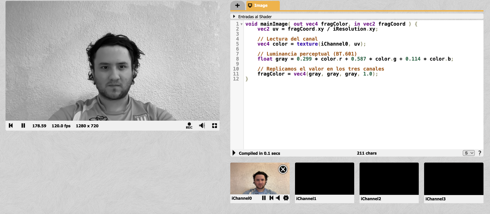

# Hit #6 — Filtro Escala de Grises

## ¿Qué es?

Pasar una imagen a blanco y negro. La idea es reemplazar el color de cada píxel por un único valor de gris que represente cuánta "luz" tiene ese píxel.

La forma ingenua sería promediar los tres canales: `gris = (R + G + B) / 3`. Funciona, pero queda raro porque el ojo humano no percibe los tres colores con la misma intensidad: vemos mucho más fuerte el verde que el azul. Si promediamos sin pesar, una zona verde y una azul con el mismo "valor" van a quedar igual de grises, cuando en realidad para nuestros ojos la verde es más brillante.

## Luminancia perceptual

Para que el gris se vea "natural" se usa una fórmula con pesos distintos para cada canal. Los pesos clásicos vienen del estándar **ITU-R BT.601** (también citado en Gonzalez & Woods, *Digital Image Processing*):

```
Y = 0.299 * R + 0.587 * G + 0.114 * B
```

El verde pesa más de la mitad, el rojo un tercio y el azul casi nada. Eso refleja cómo responde el ojo humano. Hay una versión más nueva (BT.709) con pesos `(0.2126, 0.7152, 0.0722)` que se usa en HD, pero la idea es la misma.

## Setup en ShaderToy

- `iChannel0` → cámara web o cualquier imagen/video

## Shader

```glsl
void mainImage( out vec4 fragColor, in vec2 fragCoord ) {
    vec2 uv = fragCoord.xy / iResolution.xy;

    // Lectura del canal
    vec4 color = texture(iChannel0, uv);

    // Luminancia perceptual (BT.601)
    float gray = 0.299 * color.r + 0.587 * color.g + 0.114 * color.b;

    // Replicamos el valor en los tres canales
    fragColor = vec4(gray, gray, gray, 1.0);
}
```

## Explicación

- `color` es el píxel original con sus tres canales RGB.
- `gray` es un solo número que representa el brillo del píxel según la fórmula de luminancia.
- `vec4(gray, gray, gray, 1.0)` arma un color con los tres canales iguales (R = G = B), que es lo que hace que se vea gris.

## Variante: promedio simple

Si en vez de la fórmula perceptual se usa el promedio:

```glsl
float gray = (color.r + color.g + color.b) / 3.0;
```

La imagen también queda en escala de grises, pero los verdes se ven más oscuros de lo que deberían y los azules más claros. La diferencia se nota en zonas saturadas como hojas verdes o un cielo azul.

### Captura



## Relación con CUDA

Igual que en los hits anteriores: cada píxel se calcula por su cuenta. La operación es una multiplicación-suma simple (3 mult + 2 sum por píxel), lo que en una GPU se ejecuta en paralelo sobre toda la imagen sin esfuerzo.

| Shader | CUDA |
|---|---|
| `texture(iChannel0, uv)` | lectura del array de entrada en memoria global |
| `0.299*r + 0.587*g + 0.114*b` | misma operación en cada thread |
| `fragColor = vec4(gray,...)` | escritura del resultado en el array de salida |

## Referencia

- Gonzalez, R. C., & Woods, R. E. *Digital Image Processing.* Capítulo sobre conversión RGB → gris y luminancia.
- ITU-R BT.601 / BT.709 (estándares de codificación de video).
